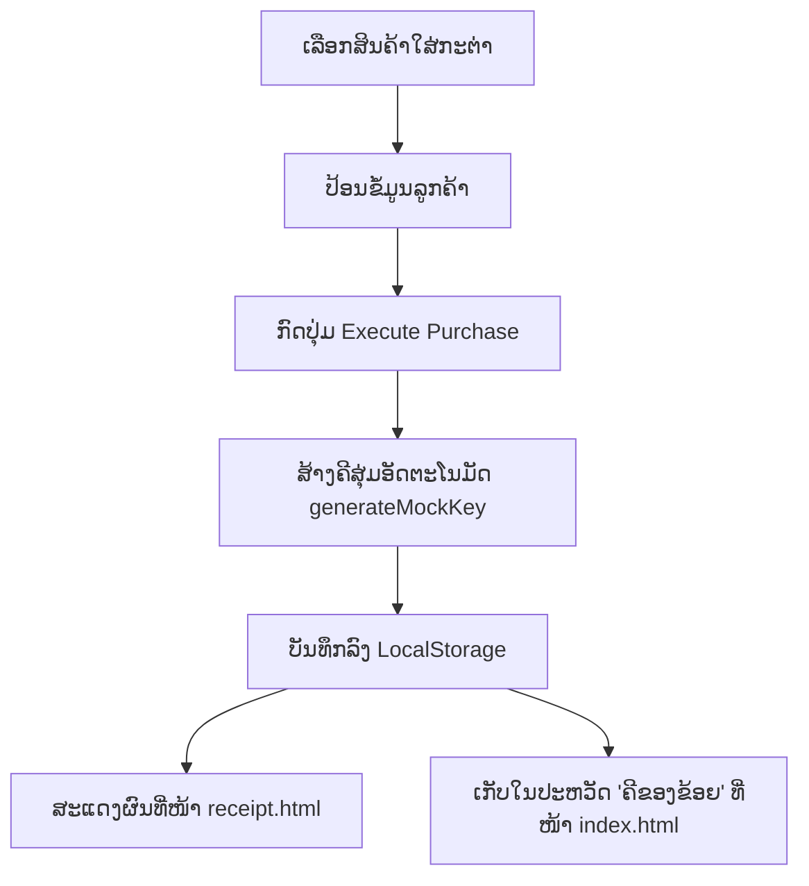

# ເອກະສານນຳສະເໜີ: ໂຄງສ້າງ ແລະ ການເຮັດວຽກຂອງລະບົບ Aoy Code Shop

ເອກະສານສະບັບນີ້ຖືກອອກແບບມາເພື່ອໃຊ້ໃນການນຳສະເໜີ (Presentation) ກ່ຽວກັບການເຮັດວຽກຂອງເວັບໄຊ **Aoy Code Shop** ໂດຍແບ່ງອອກເປັນແຕ່ລະສ່ວນຢ່າງລະອຽດ.

---

## 1. ພາບລວມຂອງລະບົບ (System Overview)
ເວັບໄຊ Aoy Code Shop ເປັນລະບົບຮ້ານຄ້າຂາຍບັດເຕີມເກມ ແລະ Code ດິຈິຕອນ ທີ່ຖືກອອກແບບດ້ວຍຮູບແບບ **Cyberpunk/Terminal Aesthetic** ໂດຍມີໜ້າວຽກຫຼັກ 3 ຢ່າງ:
1. **ໜ້າຮ້ານຄ້າ (Storefront)**: ເລືອກຊື້ສິນຄ້າ, ຈັດການກະຕ່າສິນຄ້າ, ແລະ ປ້ອນຂໍ້ມູນຜູ້ຊື້.
2. **ລະບົບຄີສຸ່ມ (Key Generator)**: ສ້າງລະຫັດ Code ສິນຄ້າແບບອັດຕະໂນມັດຕາມແຕ່ລະແບຣນ (Steam, PSN, Nintendo).
3. **ໃບບິນດິຈິຕອນ (Digital Receipt)**: ສະແດງລາຍການສັ່ງຊື້, ຂໍ້ມູນລູກຄ້າ, ລະຫັດຄີທີ່ໄດ້ຮັບ ແລະ ບາໂຄດ (Barcode).



---

## 2. ໂຄງສ້າງໄຟລ໌ໃນໂຄງການ (Project Directory)
ລະບົບປະກອບມີ 4 ໄຟລ໌ຫຼັກດັ່ງນີ້:
* **`index.html`**: ໂຄງສ້າງຂອງໜ້າຮ້ານຄ້າ ແລະ ປ໊ອບອັບ (Modal) ປະຫວັດການຊື້ຄີ.
* **`receipt.html`**: ໂຄງສ້າງຂອງໜ້າໃບບິນຮັບເງິນທີ່ໄດ້ຮັບການປັບແຕ່ງໃຫ້ສວຍງາມ.
* **`script.js`**: ຟັງຊັນຄວບຄຸມການເຮັດວຽກ, ຄຳນວນຄ່າ, ສ້າງຄີສຸ່ມ, ແລະ ເກັບຂໍ້ມູນ.
* **`style.css`**: ການກຳນົດຮູບແບບສີສັນ, ເຟຣມ, ກຣິດ, ແລະ ອະນິເມຊັນເຄື່ອນໄຫວ.

---

## 3. ອະທິບາຍການເຮັດວຽກຂອງ JavaScript (`script.js`)

ໄຟລ໌ນີ້ປຽບເໝືອນ "ສະໝອງ" ຂອງເວັບໄຊ ເຮັດໜ້າທີ່ຈັດການກັບຂໍ້ມູນ ແລະ ຟັງຊັນຕ່າງໆ.

### 3.1 ຖານຂໍ້ມູນສິນຄ້າ (`productsData`)
* **ໜ້າທີ່**: ເກັບລາຍຊື່ສິນຄ້າທັງໝົດໃນຮ້ານ (ID, ແບຣນ, ຊື່, ລາຄາ, ຮູບພາບ).
* **ໂຄດ**:
  ```javascript
  const productsData = [ { id: 1, brand: "Steam", name: "Steam Wallet Code $10", price: 240000, img: "images/steam_10.png" }, ... ]
  ```

### 3.2 ຟັງຊັນເພີ່ມສິນຄ້າໃສ່ກະຕ່າ (`addToCart`)
* **ໜ້າທີ່**: ຮັບຂໍ້ມູນສິນຄ້າທີ່ລູກຄ້າກົດເລືອກ ແລ້ວເພີ່ມເຂົ້າໄປໃນອາເຣ `basket` (ກະຕ່າ).
* **ພາລາມິເຕີ**: `pName` (ຊື່ສິນຄ້າ), `pPrice` (ລາຄາ), `pBrand` (ແບຣນ).
* **ໂຄດ**:
  ```javascript
  function addToCart(pName, pPrice, pBrand) {
    basket.push({ name: pName, price: pPrice, brand: pBrand });
    renderUI(); // ເອີ້ນໃຊ້ຟັງຊັນອັບເດດໜ້າຈໍ
  }
  ```

### 3.3 ຟັງຊັນອັບເດດໜ້າຈໍກະຕ່າສິນຄ້າ (`renderUI`)
* **ໜ້າທີ່**:
  1. ສະແດງຈຳນວນສິນຄ້າໃນກະຕ່າເທິງໄອຄອນກະຕ່າ (`#cart-count`).
  2. ຄຳນວນລາຄາລວມທັງໝົດໂດຍໃຊ້ `reduce()`.
  3. ຈັດກຸ່ມສິນຄ້າຊ້ຳກັນ (Group) ເພື່ອສະແດງຈຳນວນຄູນ (ເຊັ່ນ: x2) ໃຫ້ອ່ານງ່າຍ.
  4. ຂຽນ HTML ເຂົ້າໄປໃນ Terminal Block ເພື່ອສະແດງລາຍການໃນກະຕ່າ.

### 3.4 ຟັງຊັນສ້າງຄີສຸ່ມ (`generateMockKey`)
* **ໜ້າທີ່**: ສ້າງຄີປອມ (Mock Key) ທີ່ຄ້າຍຄືກັບຄີແທ້ ໂດຍແຍກຕາມແບຣນ.
* **ຮູບແບບທີ່ສ້າງ**:
  * **Steam**: `XXXXX-XXXXX-XXXXX`
  * **PlayStation**: `XXXX-XXXX-XXXX`
  * **Nintendo**: `XXXX-XXXX-XXXX-XXXX`
  * **Razer**: `RZ-XXXX-XXXX-XXXX`
  * **ທົ່ວໄປ**: `XXXX-XXXX-XXXX`
* **ໂຄດ**:
  ```javascript
  function generateMockKey(brand) {
    const chars = 'ABCDEFGHIJKLMNOPQRSTUVWXYZ0123456789';
    const rand = (len) => Array.from({length: len}, () => chars[Math.floor(Math.random() * chars.length)]).join('');
    // ໃຊ້ switch-case ໃນການແຍກແບຣນ...
  }
  ```

### 3.5 ຟັງຊັນຢືນຢັນການຊື້ (`confirmPurshase`)
* **ໜ້າທີ່**: ບັນທຶກຂໍ້ມູນທັງໝົດເມື່ອລູກຄ້າກົດຊື້.
  1. ກວດສອບຄວາມຖືກຕ້ອງ (ຕ້ອງປ້ອນຊື່, ເບີໂທ ແລະ ມີສິນຄ້າໃນກະຕ່າ).
  2. ວົນລູບສິນຄ້າໃນກະຕ່າ ແລ້ວເອີ້ນໃຊ້ `generateMockKey(item.brand)` ເພື່ອສ້າງຄີໃຫ້ທຸກຊິ້ນ.
  3. ບັນທຶກຂໍ້ມູນລົງ `localStorage` ພາຍໃຕ້ຄີ `'myOrder'` (ສຳລັບໃບບິນປັດຈຸບັນ).
  4. ບັນທຶກລົງອາເຣປະຫວັດ `'purchasedKeysHistory'` (ສຳລັບເບິ່ງຍ້ອນຫຼັງ).
  5. ນຳທາງ (Redirect) ໄປໜ້າ `receipt.html`.

### 3.6 ຟັງຊັນຄັດລອກຄີ (`copyKey`)
* **ໜ້າທີ່**: ຄັດລອກລະຫັດຄີໄປທີ່ Clipboard ຂອງຄອມພິວເຕີ/ມືຖື ແລະ ສະແດງໄອຄອນຕິກຖືກສີຂຽວເພື່ອບອກວ່າ "ຄັດລອກສຳເລັດ".
* **ໂຄດ**:
  ```javascript
  function copyKey(keyText, btnId) {
    navigator.clipboard.writeText(keyText).then(() => {
      // ປ່ຽນປຸ່ມເປັນໄອຄອນ Checkmark 2 ວິນາທີ ແລ້ວກັບຄືນເປັນຄືເກົ່າ
    })
  }
  ```

### 3.7 ຟັງຊັນສະແດງປະຫວັດການຊື້ຄີ (`renderKeysHistory`)
* **ໜ້າທີ່**: ດຶງຂໍ້ມູນ `'purchasedKeysHistory'` ຈາກ `localStorage` ມາແຕ້ມເປັນກາດລາຍການສັ່ງຊື້ໃນ Modal ທີ່ໜ້າຫຼັກ. ຖ້າບໍ່ມີປະຫວັດ ຈະສະແດງຂໍ້ຄວາມ "ບໍ່ພົບປະຫວັດການຊື້ຄີ".

---

## 4. ໂຄງສ້າງ ແລະ ການອອກແບບໜ້າຈໍ (`index.html` & `style.css`)

### 4.1 ປຸ່ມ "ຄີຂອງຂ້ອຍ" ແລະ ປ໊ອບອັບ (Modal)
* **ປຸ່ມ `#key-history-btn`**: ປຸ່ມສີສົ້ມນີອອນ ຕັ້ງຢູ່ສ່ວນຫົວ (Header) ເມື່ອກົດຈະເປີດ Modal ປະຫວັດຄີ.
* **ໂຄງສ້າງ Modal (`#keys-modal`)**:
  * ໃຊ້ `backdrop-filter: blur(12px)` ເພື່ອເຮັດໃຫ້ພື້ນຫຼັງມົວ ເພີ່ມຄວາມພຣີມ່ຽມ.
  * ໃຊ້ `.modal.show` ໃນການກຳນົດ CSS ເປີດ-ປິດ ຜ່ານ JavaScript ຢ່າງນຸ້ມນວນ.

### 4.2 ການອອກແບບສ່ວນຫົວ "AOY CODE SHOP" (Brand Decor)
* **CSS Shifting Gradient**: ປຸ່ມໂລໂກ້ `⫸` ຫຼິ້ນລະດັບສີ (Indigo ຫາ Teal) ທີ່ເຄື່ອນໄຫວໄປມາຕະຫຼອດເວລາດ້ວຍ `@keyframes logo-gradient-shift`.
* **Hover Animation**: ເມື່ອເອົາມືໄປຈີ້ (Hover) ໂລໂກ້ຈະໃຫຍ່ຂຶ້ນ 10% ພ້ອມໝູນ 5 ອົງສາ ແລະ ຕົວອັກສອນ `⫸` ຈະເລື່ອນໄປທາງຂວາເລັກນ້ອຍ.
* **Terminal Cursor**: ຂໍ້ຄວາມຄຳອະທິບາຍມີຕົວອັກສອນ `█` ກະພິບຢູ່ທາງຫຼັງ ຄ້າຍຄືກັບໜ້າຈໍ Command Line ຂອງແຮັກເກີ.

---

## 5. ການອອກແບບໃບບິນໃໝ່ (`receipt.html`)

ພວກເຮົາໄດ້ປັບປຸງໜ້າໃບບິນໃຫ້ອ່ານງ່າຍ ແລະ ມີຄວາມເປັນມືອາຊີບສູງ:
1. **Pulsing Badge (ໄອຄອນຕິກຖືກເຄື່ອນໄຫວ)**: ຢູ່ສ່ວນເທິງສຸດ ເປັນໄອຄອນວົງມົນສີຂຽວທີ່ກະພິບເຕືອນຄວາມຮຽບຮ້ອຍ (ORDER COMPLETE).
2. **Customer Info Grid**: ຈັດວາງຂໍ້ມູນລູກຄ້າເປັນ **ກຣິດ 2 ຄໍລຳ (2x2 Grid)** ເຮັດໃຫ້ເບິ່ງເປັນລະບຽບ ແລະ ມີໄອຄອນກຳກັບ (ປະຕິທິນ, ຜູ້ໃຊ້, ເບີໂທ, ທີ່ຢູ່).
3. **Inline Key Cards**: ໃຕ້ຊື່ສິນຄ້າແຕ່ລະຕົວ ຈະມີກາດສີດຳຂອບເຫຼືອງ ສະແດງຄີສິນຄ້າທີ່ໄດ້ຮັບ ພ້ອມປຸ່ມກົດ Copy ທີ່ສະດວກສະບາຍ.
4. **Gradient Total Box**: ກ່ອງລາຄາລວມທັງໝົດທີ່ໂດດເດັ່ນດ້ວຍພື້ນຫຼັງສີມ່ວງ-ຟ້າ ເຮັດໃຫ້ເຫັນຕົວເລກລາຄາຊັດເຈນ.
5. **Decorative Barcode**: ບາໂຄດດິຈິຕອນທີ່ສ້າງຈາກ CSS ຢູ່ສ່ວນທ້າຍ ເພື່ອເພີ່ມຄວາມເປັນເອກະລັກຂອງຮ້ານຄ້າໄອທີ.

---

## 6. ຂັ້ນຕອນການທົດສອບ ແລະ ຜົນການເຮັດວຽກ (Demo Verification)
1. **ຂັ້ນຕອນການຊື້**: ເລືອກບັດ Steam $10 ແລະ PlayStation $20 ໃສ່ກະຕ່າ -> ກອກຂໍ້ມູນ -> ກົດ Execute Purchase.
2. **ຜົນຮັບ**: ລະບົບໄປໜ້າໃບບິນ ແລະ ສ້າງຄີເຊັ່ນ: `STEAM-8D2A1-K9P0L` ແລະ `PSN-9A1F-3D2E` ໃຫ້ທັນທີ.
3. **ການໃຊ້ງານ**: ທົດສອບກົດ Copy ສາມາດກົດຄັດລອກຄີໄດ້ທັງໜ້າໃບບິນ ແລະ ໜ້າປະຫວັດຄີໃນ Modal ຢ່າງສົມບູນ.
