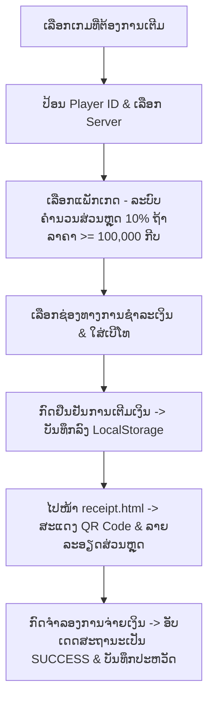

# ເອກະສານນຳສະເໜີ: ໂຄງສ້າງ ແລະ ການເຮັດວຽກຂອງລະບົບ Aoy Topup

ເອກະສານສະບັບນີ້ຖືກອອກແບບມາເພື່ອໃຊ້ໃນການນຳສະເໜີ (Presentation) ກ່ຽວກັບການເຮັດວຽກຂອງເວັບໄຊ **Aoy Topup** (ລະບົບເຕີມເກມອັດຕະໂນມັດ 24 ຊົ່ວໂມງ) ໂດຍແບ່ງອອກເປັນແຕ່ລະສ່ວນຢ່າງລະອຽດ.

---

## 1. ພາບລວມຂອງລະບົບ (System Overview)
ເວັບໄຊ Aoy Topup ເປັນລະບົບເຕີມເກມມືຖື ແລະ ຄອມພິວເຕີ ທີ່ຖືກອອກແບບດ້ວຍຮູບແບບ **Premium Cyberpunk/Gaming Aesthetic** ໂດຍມີໜ້າວຽກຫຼັກ 3 ຢ່າງ:
1. **ໜ້າຫຼັກ (Home Page)**: ແນະນຳບໍລິການ, ຈຸດເດັ່ນຂອງຮ້ານ ແລະ ສະແດງລາຍຊື່ເກມທີ່ຮອງຮັບ (Link ໄປຍັງໜ້າເຕີມເງິນ).
2. **ໜ້າເຕີມເກມ (Top-up Page)**: ຟອມເຕີມເງິນ 4 ຂັ້ນຕອນ (ເລືອກເກມ -> ໃສ່ ID ຜູ້ຫຼິ້ນ/ເຊີບເວີ -> ເລືອກແພັກເກດ -> ເລືອກຊ່ອງທາງຈ່າຍເງິນ) ພ້ອມກັບແຖບສະຫຼຸບການສັ່ງຊື້ ແລະ **ລະບົບສ່ວນຫຼຸດພิເສດ 10%**.
3. **ໃບບິນ ແລະ ບັດສະແກນ QR (Digital Receipt & QR Pay)**: ສະແດງລາຍການສັ່ງຊື້, ຂໍ້ມູນບັນຊີເກມ, ຂໍ້ມູນການຕິດຕໍ່, ສ່ວນຫຼຸດ, ລາຄາສຸດທິ ແລະ ລະບົບຈຳລອງການຈ່າຍເງິນຜ່ານ QR (BCELOne, U-Money, LDB).



---

## 2. ໂຄງສ້າງໄຟລ໌ໃນໂຄງການ (Project Directory)
ລະບົບປະກອບມີ 5 ໄຟລ໌ຫຼັກດັ່ງນີ້:
* **`index.html`**: ໜ້າຫຼັກຂອງເວັບໄຊ, ຂໍ້ມູນຈຸດເດັ່ນ, ແລະ ລາຍຊື່ເກມທີ່ເປີດໃຫ້ບໍລິການ.
* **`topup.html`**: ໜ້າຫຼັກຂອງລະບົບເຕີມເກມ 4 ຂັ້ນຕອນ ພ້ອມແຖບສະຫຼຸບ ແລະ ປຸ່ມຢືນຢັນ.
* **`receipt.html`**: ໜ້າໃບບິນແຈ້ງຊຳລະເງິນ ແລະ ສະແດງ QR ໂຄດຈຳລອງການໂອນເງິນ.
* **`script.js`**: ຖານຂໍ້ມູນເກມ, ຟັງຊັນການເລືອກເກມ/ແພັກເກດ/ຊ່ອງທາງຈ່າຍ, ຄຳນວນສ່ວນຫຼຸດ 10%, ແລະ ບັນທຶກປະຫວັດ.
* **`style.css`**: ການກຳນົດຮູບແບບ Cyberpunk Dark Mode, UI Glassmorphism, ປ້າຍສ່ວນຫຼຸດ, ແລະ ອະນິເມຊັນ **Bounce-Up** ຕອນໂຫຼດໜ້າ.

---

## 3. ອະທິບາຍການເຮັດວຽກຂອງ JavaScript (`script.js`)

ໄຟລ໌ນີ້ປຽບເໝືອນ "ສະໝອງ" ຂອງລະບົບ ເຮັດໜ້າທີ່ຈັດການກັບຂໍ້ມູນ ແລະ ຟັງຊັນຕ່າງໆ.

### 3.1 ຖານຂໍ້ມູນເກມ ແລະ ແພັກເກດ (`gamesData`)
* **ໜ້າທີ່**: ເກັບລາຍຊື່ເກມ, ຮູບພາບ, ຄຳແນະນຳ ID ຜູ້ຫຼິ້ນ, ຂໍ້ມູນເຊີບເວີ, ແລະ ອາເຣຂອງແພັກເກດຕ່າງໆ (ID, ຊື່, ລາຄາ).
* **ໂຄດຕົວຢ່າງ**:
  ```javascript
  const gamesData = [
    {
      id: "freefire",
      name: "Garena Free Fire",
      img: "images/free_fire_card.png",
      packages: [
        { id: "ff_50", name: "50 Diamonds", price: 12000 },
        { id: "ff_520", name: "520 Diamonds", price: 115000 } // ລາຄານີ້ຈະໄດ້ຮັບສ່ວນຫຼຸດ 10%
      ]
    }, ...
  ]
  ```

### 3.2 ຟັງຊັນເລືອກເກມ (`selectGame`)
* **ໜ້າທີ່**: ປ່ຽນສະຖານະຂອງເກມທີ່ຖືກເລືອກ, ເປີດໃຊ້ຂັ້ນຕອນປ້ອນ ID, ໂຫຼດລາຍຊື່ເຊີບເວີ (ຖ້າມີ), ແລະ ແຕ້ມລາຍການແພັກເກດຂອງເກມນັ້ນໆ ອອກມາໃນໜ້າຈໍ.

### 3.3 ຟັງຊັນເລືອກແພັກເກດ ແລະ ຄຳນວນສ່ວນຫຼຸດ (`selectPackage`)
* **ໜ້າທີ່**: ຮັບຂໍ້ມູນແພັກເກດທີ່ເລືອກ ແລະ **ຄຳນວນສ່ວນຫຼຸດ 10%** ໂດຍອັດຕະໂນມັດ ຫາກລາຄາແພັກເກດຮອດ 100,000 ກີບ ຂຶ້ນໄປ.
* **ໂຄດ**:
  ```javascript
  const originalPrice = pkg.price;
  let discount = 0;
  if (originalPrice >= 100000) {
    discount = Math.round(originalPrice * 0.10);
  }
  const finalPrice = originalPrice - discount;
  ```
* **การສະແດງຜົນ**: ຫາກມີສ່ວນຫຼຸດ ລະບົບຈະສະແດງແຖບສ່ວນຫຼຸດສີແດງແອັກເຊນ (`#summary-discount-row`) ແລະ ປັບລາຄາສຸດທິທີ່ຈະຕ້ອງຊຳລະໃນແຖບສະຫຼຸບ.

### 3.4 ຟັງຊັນຢືນຢັນການເຕີມເກມ (`executeTopup`)
* **ໜ້າທີ່**: ບັນທຶກຂໍ້ມູນການເຕີມເກມລົງ `localStorage`.
  1. ກວດສອບຄວາມຖືກຕ້ອງ (ຕ້ອງປ້ອນ ID, ເລືອກເຊີບເວີ (ຖ້າມີ), ປ້ອນເບີໂທຕິດຕໍ່).
  2. ສ້າງລະຫັດທຸລະກຳ (`orderId`) ເຊັ່ນ `TXN-832901`.
  3. ຄຳນວນສ່ວນຫຼຸດ ແລະ ລາຄາສຸດທິອີກຄັ້ງ ເພື່ອບັນທຶກລົງ `localStorage` ພາຍໃຕ້ຄີ `'myOrder'`.
  4. ເພີ່ມທຸລະກຳເຂົ້າໄປໃນປະຫວັດ `'purchasedKeysHistory'` ຢູ່ສ່ວນເທິງສຸດ (`unshift`).
  5. ນຳທາງ (Redirect) ໄປໜ້າ `receipt.html`.

### 3.5 ຟັງຊັນສະແດງປະຫວັດການເຕີມ (`renderKeysHistory`)
* **ໜ້າທີ່**: ດຶງຂໍ້ມູນປະຫວັດມາສະແດງໃນ Modal. ຫາກລາຍການໃດມີສ່ວນຫຼຸດ ຈະສະແດງ **ລາຄາເດີມແບບຂີດຂ້າ** (Strikethrough) ຄູ່ກັບລາຄາສຸດທິສີຂຽວ ເພື່ອໃຫ້ລູກຄ້າເຫັນຍອດປະຢັດຂອງຕົນເອງ.

---

## 4. ໂຄງສ້າງ ແລະ ການອອກແບບ UI (`style.css`)

### 4.1 ປ້າຍສ່ວນຫຼຸດແພັກເກດ (`.discount-tag`)
* **ໜ້າທີ່**: ເປັນປ້າຍບອກສ່ວນຫຼຸດ **"ຫຼຸດ 10%"** ທີ່ຕິດຢູ່ເທິງກາດແພັກເກດທີ່ລາຄາຮອດເກນ 100,000 ກີບ ເພື່ອດຶງດູດຄວາມສົນໃຈ.
* **ໂຄດ CSS**:
  ```css
  .discount-tag {
    position: absolute;
    top: 10px;
    right: 10px;
    background: linear-gradient(135deg, var(--accent-rose), #ff6b8b);
    color: white;
    font-size: 0.72rem;
    font-weight: 700;
    padding: 4px 10px;
    border-radius: 20px;
    box-shadow: 0 4px 10px rgba(244, 63, 94, 0.3);
  }
  ```

### 4.2 ອະນິເມຊັນ Bounce-Up ຕອນໂຫຼດໜ້າ (`bounceUp`)
* **ໜ້າທີ່**: ເຮັດໃຫ້ໜ້າເວັບ (`.app-shell` ແລະ `.receipt-container`) ເດີນທາງເຂົ້າສູ່ໜ້າຈໍຢ່າງມີມິຕິ ແລະ ເປັນທຳມະຊາດ ບໍ່ແຂງທື່ອ.
* **ໂຄດ CSS**:
  ```css
  @keyframes bounceUp {
    0% {
      opacity: 0;
      transform: translateY(40px) scale(0.96);
    }
    100% {
      opacity: 1;
      transform: translateY(0) scale(1);
    }
  }
  .app-shell, .receipt-container {
    animation: bounceUp 0.65s cubic-bezier(0.34, 1.56, 0.64, 1) forwards;
  }
  ```

---

## 5. ໜ້າໃບບິນ ແລະ ຈຳລອງການຈ່າຍເງິນ (`receipt.html`)

1. **ການດຶງຂໍ້ມູນສ່ວນຫຼຸດ**: ໜ້າໃບບິນຈະດຶງຂໍ້ມູນ `'myOrder'` ຈາກ `localStorage` ມາສະແດງ. ຫາກມີສ່ວນຫຼຸດ ຈະເປີດສະແດງແຖວ **ລາຄາປົກກະຕິ** ແລະ **ສ່ວນຫຼຸດ (10%)** ໃຫ້ເຫັນຢ່າງຊັດເຈນ.
2. **QR Payment Section**: ສະແດງ QR Code ຈຳລອງ ແລະ ຍອດເງິນສຸດທິທີ່ຕ້ອງຊຳລະ (ລາຄาຫຼັງຫຼຸດແລ້ວ).
3. **Simulate Button**: ເມື່ອກົດປຸ່ມ "ຂ້ອຍໂອນເງິນແລ້ວ", ລະບົບຈະປ່ຽນສະຖານະໃບບິນເປັນ **SUCCESS** (ສຳເລັດ) ແລະ ອັບເດດຂໍ້ມູນໃນປະຫວັດທັນທີ.

---

## 6. ຂັ້ນຕອນການທົດສອບລະບົບ (System Verification)
1. **ທົດສອບແພັກເກດລາຄາຕ່ຳ**: ເລືອກ Free Fire 50 Diamonds ລາຄາ 12,000 ກີບ -> ບໍ່ມີປ້າຍສ່ວນຫຼຸດ -> ຍອດຊຳລະແມ່ນ 12,000 ກີບ (ປົກກະຕິ).
2. **ທົດສອບແພັກເກດລາຄາສູງ**: ເລືອກ Roblox 1,700 Robux ລาຄາ 370,000 ກີບ -> ມີປ້າຍແດງ **"ຫຼຸດ 10%"** -> ລະບົບຄຳນວນສ່ວນຫຼຸດ 37,000 ກີບ -> ຍອດຊຳລະສຸດທິເຫຼືອ 333,000 ກີບ.
3. **ທົດສອບການຢືນຢัน**: ປ້ອນ ID ແລະ ເບີໂທ -> ກົດຢືນຢັນ -> ລະບົບສະແດງໃບບິນທີ່ລະບຸສ່ວນຫຼຸດ 37,000 ກີບ ແລະ ຍອດໂອນ QR ເປັນ 333,000 ກີບ ຢ່າງຖືກຕ້ອງ.
